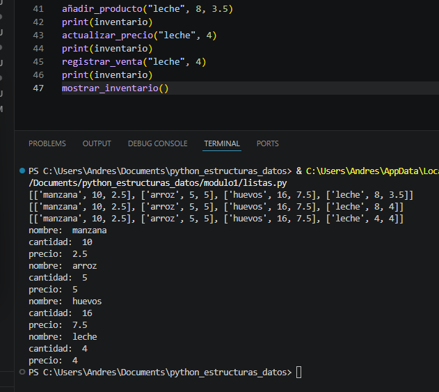

# Descripcion

Este es un proyecto de estructuras de python en donde se muestran ejemplos para una enseñanza mas adecuada, estos contienen unos retos separados por modulos y estructuras de datos, cada modulo tiene su reto

# Modulo 1 Listas()
