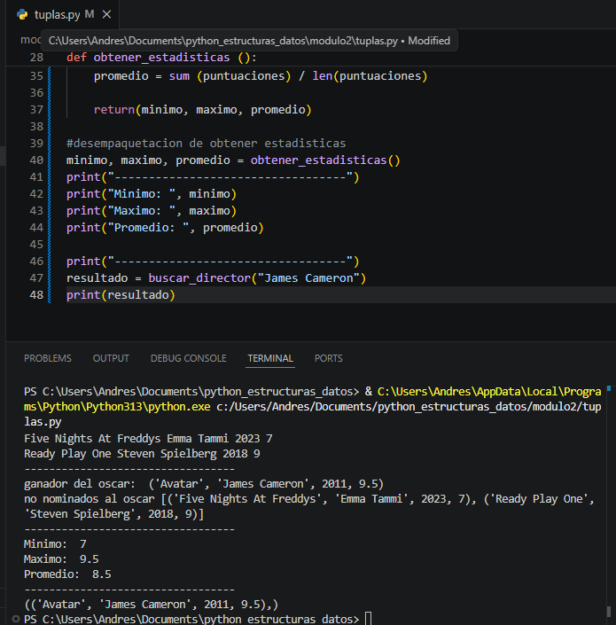
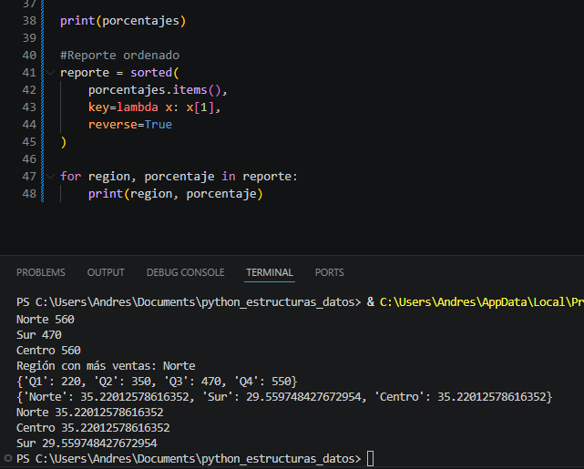
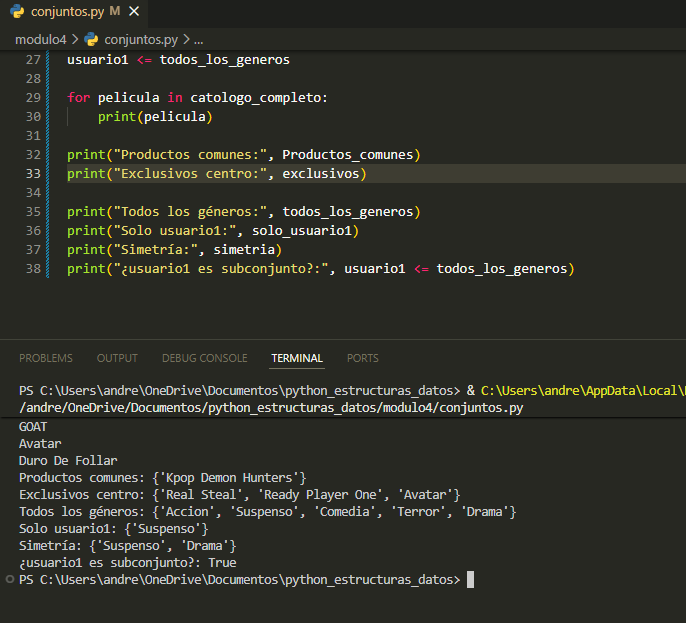

# Descripcion

Este es un proyecto de estructuras de python en donde se muestran ejemplos para una enseñanza mas adecuada, estos contienen unos retos separados por modulos y estructuras de datos, cada modulo tiene su reto

# Modulo 1 Listas()

Explicacion:
Segun lo que entendi las listas son capaces de almacenar varios tipos de datos o elementos en una sola variable incluso nos permite almacenar otras listas dentro de una lista y podemos recorrerlo mediante sus indices o incluso modificar los datos

# Modulo 2 Tuplas()

Explicacion:
Resumiendo mi entendimiento sobre tuplas es que son como las listas PEEERO son inmutables, eso solo significa que no se pueden modificar como las listas, sus datos son estaticos, tambien que en ves de [ ] se usan ( ) y pues de resto los veo igual

# Modulo 3 Diccionarios()

Explicacion:
Un diccionario es una de las estructuras de datos que permite almacenar información en pares y se basa en clave y valor o algo asi, tambien se podria decir que cada clave identifica un valor, lo que facilita acceder a los datos de forma directa sin depender de posiciones como en las listas o tuplas.

# Modulo 4 Conjuntos()

Explicacion:
En pocas palabras de lo que eh entendido de los conjuntos es que se parecen mucho a los diccionarios o algo asi como una combinacion de diccionarios y listas y tienen varias subfunciones o algo asi que permiten poder hacer distintas cosas con con los conjuntos, sea actualizar alguna informacion o algo asi, borrarlos, o añadir mas datos
